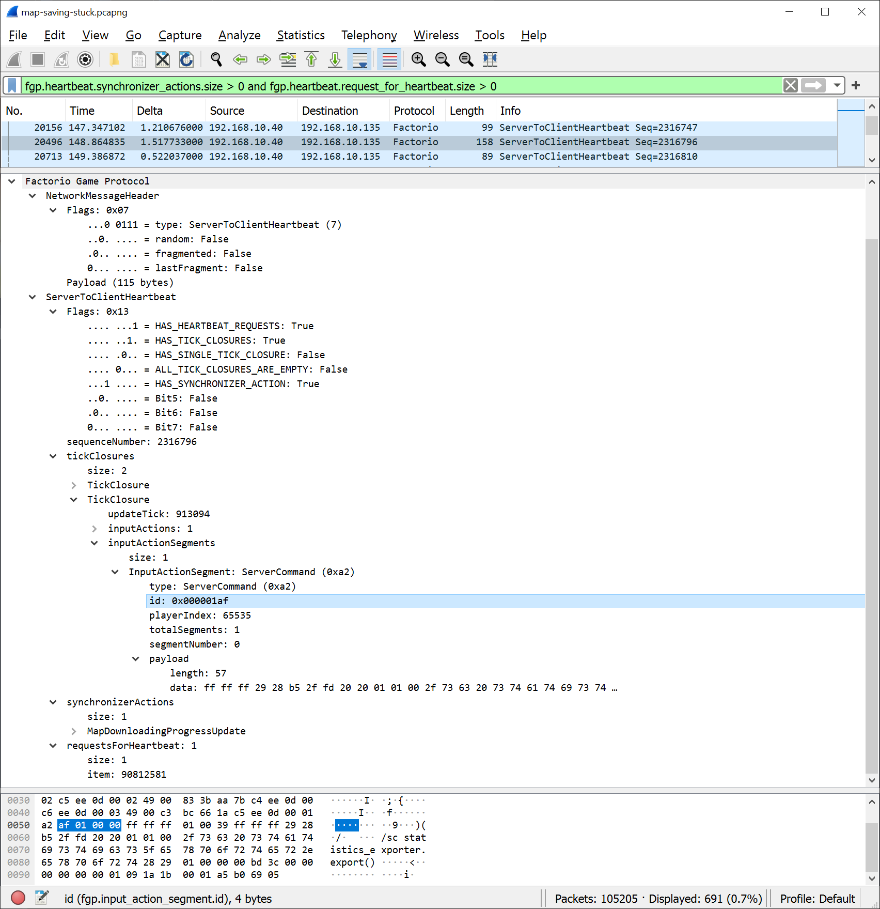

# Factorio Dissector

Plugin that dissects packets from Factorio in Wiresharke.

To install this plugin copy factorio.lua to Wireshark's plugin directory.
(on windows this directory is in %APPDATA%\\Wireshark\\plugins, you may have to create it.)

Only the latest version of Factorio is supported, most parts of the protocol is not dissected and many parts miss decoding or is decoded incorrectly.
Contributions adding decoding of more fields is welcome, but please do try to follow the code style of dissector.

## Resources used

For the most part the decoding was deduced by staring at hex dumps of the packets for a very long time.
Names for fields and the packet structure was taken from factorio.pdb using a text dump of the type information with [cvdump.exe][cvdump].

[cvdump]: https://github.com/Microsoft/microsoft-pdb/blob/master/cvdump/cvdump.exe

## License

This project is licensed under the GPL Version 2 or later.
